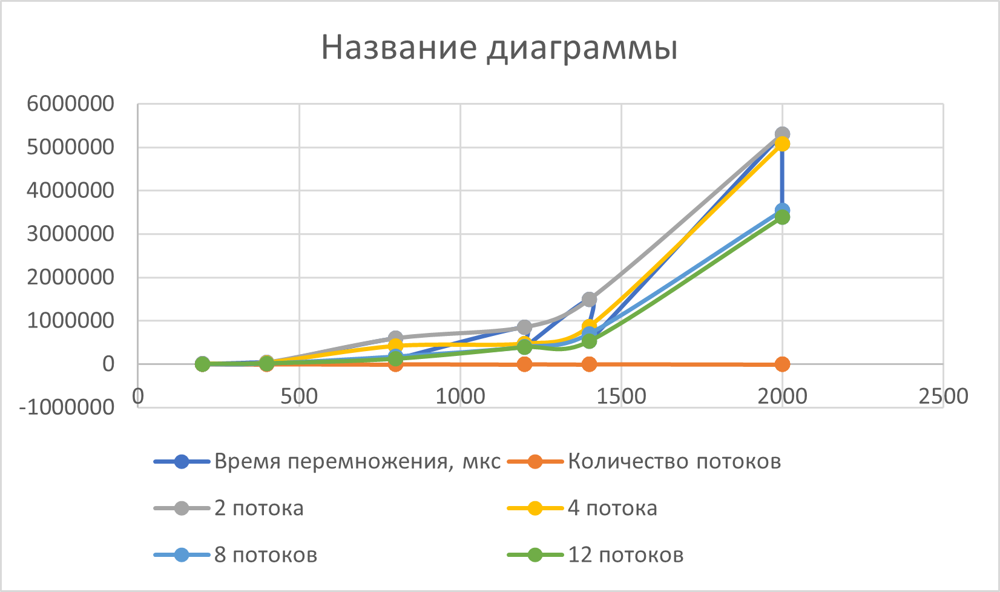

# parallel-programming
Отчёт

## Время перемножения матриц

| размеры    | 2 потока  | 4 потока  | 8 потоков  | 12 потоков  |
|------------|-----------|-----------|------------|-------------|
| 200        | 6671      | 4161      | 1086       | 998         |
| 400        | 47793     | 32911     | 19194      | 14405       |
| 800        | 601139    | 414375    | 179714     | 121156      |
| 1200       | 857135    | 470913    | 402033     | 387814      |
| 1400       | 1492809   | 863100    | 702416     | 523198      |
| 2000       | 5299480   | 5082111   | 3543681    | 3397238     |

## График

## Вывод
В ходе работы я написала программу на C++, которая умножает две квадратные матрицы. Для ускорения вычислений я использовала технологию MPI — это позволило задействовать несколько потоков процессора одновременно и еще больше модернизировать процесс перемножения матриц в сравнении с технологией OpenMP. В результате выигрыш в производительности очевиден и коэффициент составляет от 1,5 до 1,8. В программе можно выбрать количество потоков и проверить, как это влияет на скорость.

Я провела эксперименты с матрицами разного размера — от 200×200 до 2000×2000 — и замерила время умножения при 2, 4, 8 и 12 потоках. Результаты показали, что с увеличением числа потоков время умножения сокращается, особенно на больших матрицах.

Чтобы убедиться, что программа работает правильно, я сравнила результаты с вычислениями в Python с помощью библиотеки NumPy. Файлы полностью совпали, значит, умножение выполнено верно.

В итоге я получила рабочую программу для умножения матриц, провела замеры производительности и подтвердила точность вычислений.
