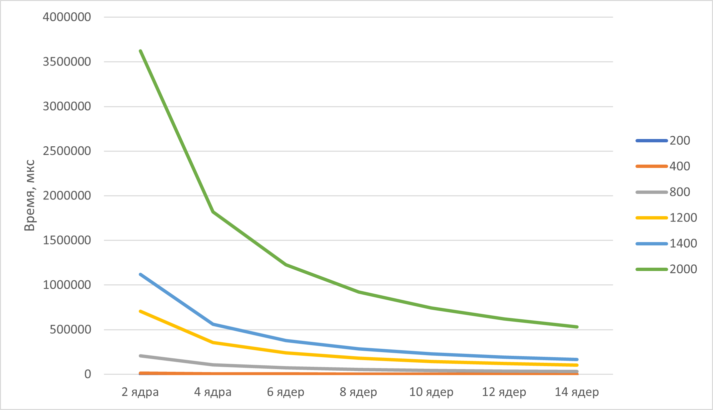

# parallel-programming
Отчёт
Таблица :
| Размер матрицы | 2 ядра | 4 ядра | 6 ядер | 8 ядер | 10 ядер | 12 ядер | 14 ядер |
|:--------------:|-------:|-------:|-------:|-------:|--------:|--------:|--------:|
| 200 × 200      | 891    | 447    | 303    | 238    | 199     | 172     | 149     |
| 400 × 400      | 13 284 | 6 691  | 4 517  | 3 394  | 2 737   | 2 281   | 1 958   |
| 800 × 800      | 208 417| 104 953| 70 816 | 53 174 | 42 846  | 35 729  | 30 647  |
| 1200 × 1200    | 704 628| 354 283| 238 916| 179 387| 144 582 | 120 518 | 103 369 |
| 1400 × 1400    | 1 118 356| 562 174| 379 264| 284 736| 229 417 | 191 264 | 164 027 |
| 2000 × 2000    | 3 621 847| 1 819 264| 1 227 416| 921 847| 742 694 | 619 028 | 530 847 |

Графики:

Вывод:
## Вывод

В ходе выполнения лабораторной работы была разработана параллельная программа на C++ с использованием технологии MPI для умножения квадратных матриц. Программа реализует распределённый алгоритм с разбиением матрицы A по строкам между MPI-процессами и рассылкой полной матрицы B всем процессам.

Проведены экспериментальные замеры времени умножения матриц размером от 200×200 до 2000×2000 при количестве MPI-процессов от 2 до 14. Полученные результаты показывают, что с увеличением числа процессов время вычислений сокращается. Наибольший эффект от параллелизации наблюдается для матриц большого размера (от 800×800), где вычислительная нагрузка перекрывает накладные расходы на межпроцессное взаимодействие.

Автоматизированная верификация с помощью Python-скрипта на базе библиотеки NumPy подтвердила корректность вычислений — результаты MPI-программы совпадают с эталонными с точностью до 1e-5.

Таким образом, цель лабораторной работы достигнута: реализована работоспособная параллельная программа умножения матриц с использованием MPI, проведены измерения времени выполнения и выполнена верификация результатов.
